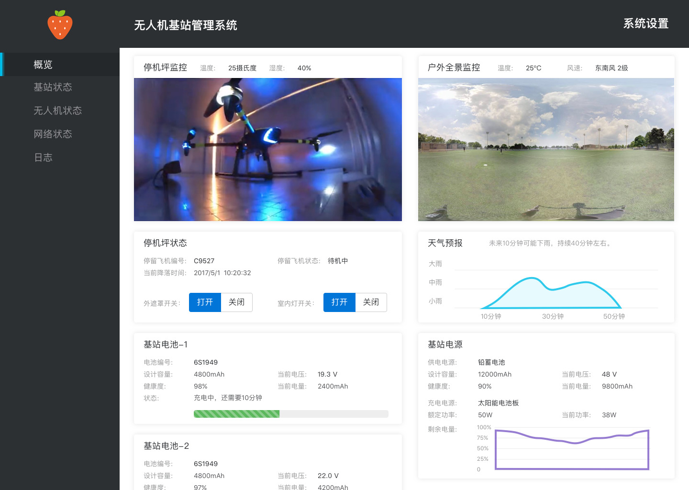

SDWC v3.0 == SuperDock Web Console
=====

> A Vue.js project
>
> element-ui


## Config

config.json


## Build Setup

``` bash
# install dependencies
yarn install

# serve with hot reload at localhost:8080
yarn run dev

# build for production with minification
yarn run build
```

## Update Log

year month day

- 2018.0124
  - start_public
- 2018.0129
  - add node video type
  - add video type flv
- 2018.0130
  - rename type to type_name (有些后端框架type是保留字段，为了消除歧义重命名此字段)
- 2018.0205
  - add oauth 2.0 type: password

## Todo List
- [ ] English Doc
- [x] add flv.js
- [ ] add hls.js
- [ ] mavlink components

## 中文文档

本程序由草莓科技开发并开源，以MPL-2.0协议开源，目地是想做一个通用型控制台

使用 vue 全家桶 + element-ui + axios.js 开发

可以实现同时控制多台设备

有些东西不知道如何中描述～ (￣∇￣) ～ 请参上面的英文文档

##### 程序框架父子组件关系图

* app
  - login
  - dashboard
    - header
    - sidemenu
    - tabs
      - context

## ××××× 重要！！！！

程序启动默认加载 / 目录下的 config.json 配置文件

```
cp src/config.json ./

```

如果没找到文件，默认启本文件加载 samples 目录下的数据（本地数据）

这样可以启用本地调试账号

>user: debug
>
>pass: debug

## 关于token 认证
目前支持在url里埋token方式

1. 在suffix 变量里设置好token变量名
2. 在login 返回json 中设置 url_token 参数为 true
3. token 值会自动加在 suffix 后面，每次请求会自动添加token

还支持oauth2.0 password 模式认证


### 生命周期异步资源加载过程
1. load config.json
2. auth user [post && get]
3. get nodes list
4. get node detail && link node

### 目录模块

##### samples
提供本地数据，异步请求数据样本

##### contexts
内容模目录

提供两个内容模型
- contexts
  - air
  - depot

调用 components 里模块

##### components
功能组件
- components
  - webterminal
    - command.json
  - monitor-img

### old
old 目录下的是 2.0 版本程序 （已废弃）可以拿来做参考（如电源模块）～ (・∀・) ～


v1.0 版 （已无参价值）


